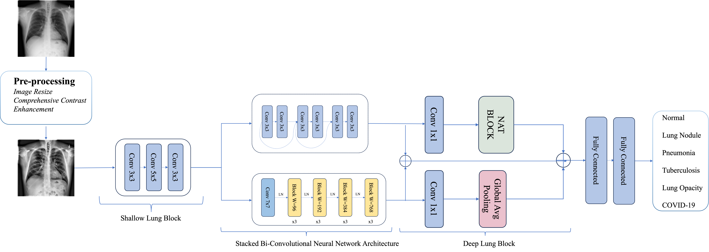

# SBNN_Medical
Open source codes of Stacked Bi-Convolutional Neural Network with feature pre-extraction and fusion module to diagnose common lung diseases from x-ray imagery
# Overview

The overview of our stacked Bi-Convolutional Neural Network

# Experiment
| Augmentation | SLB | DLB | Accuracy  | Specificity | Precision |
|--------------|-----|-----|-----------|-------------|-----------|
|              |     |     | 94.10%    | 93.68%      | 94.38%    |
| ✓            |     |     | 95.23%    | 92.83%      | 94.44%    |
| ✓            | ✓   |     | 97.37%    | 97.88%      | 96.93%    |
| ✓            | ✓   | ✓   | **98.76%**| **98.88%**  | **98.73%**|
